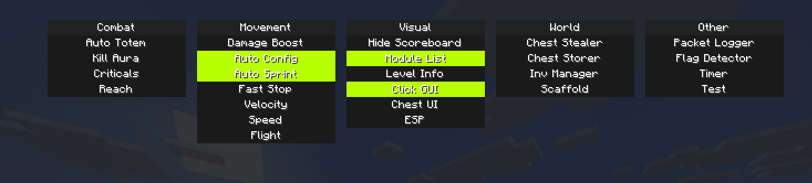

# Aster

Simple and compact Minecraft 26.2 cheat made for SMPs.

## Notes / Known Issues
The entire client was made in around a week, therefore it might contain some bugs, and the code is not the best in some places. This is also my first time making a proper Minecraft Java cheat (I mostly did Bedrock cheat development and native reverse engineering before).

The bypasses in this client are mostly made for NCP and the custom anticheats of the servers I play on.

Known issues:
1. Criticals doesn't handle attacks not made by Kill Aura. *This isn't hard to fix. I will do it eventually.*
2. Scaffold only does really basic rotations (just does pitch = -89F) at the moment.
3. Kill Aura lacks a vanilla rotation mode (i.e., properly rotating to the entity without flicking or snapping, hitting it, and optionally rotating back).
4. Kill Aura should probably use the `PacketRewriter` utility

Todo:
1. Fast Break / Fast Place
2. XRay / Ore ESP
3. NoFovEffects
4. NoLevitation
